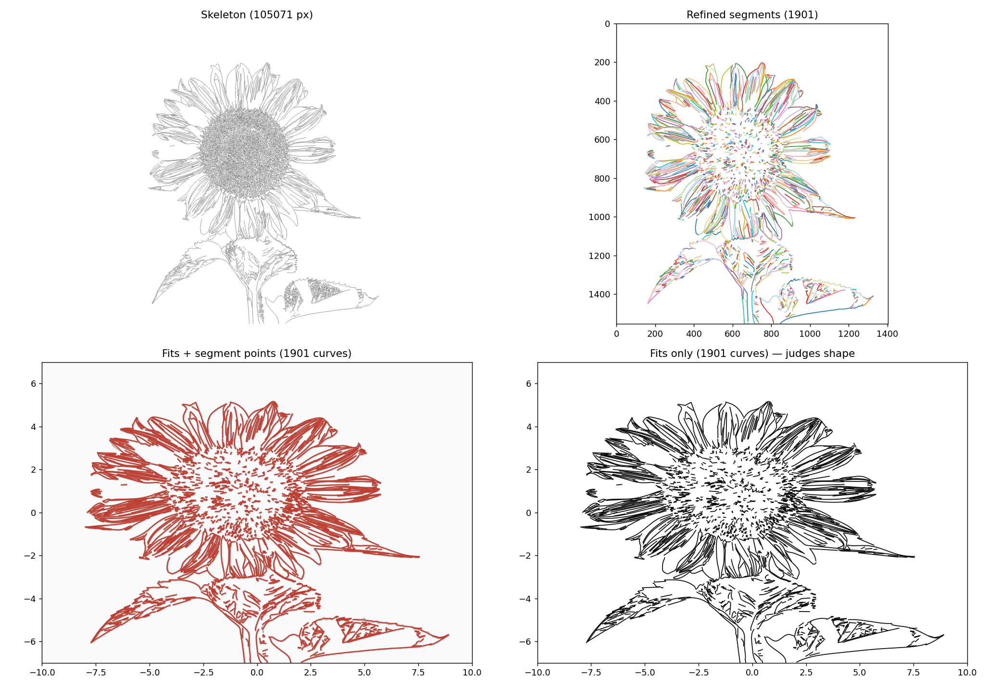
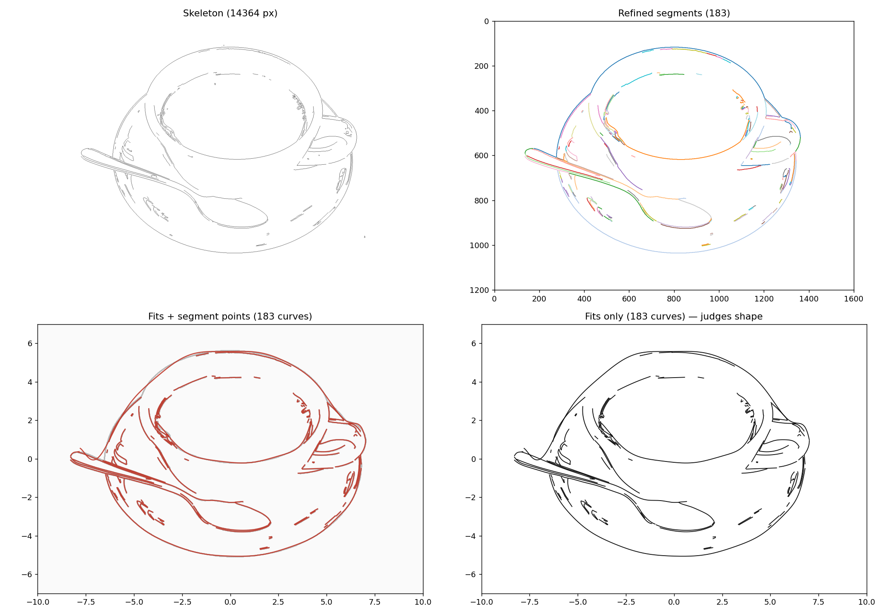
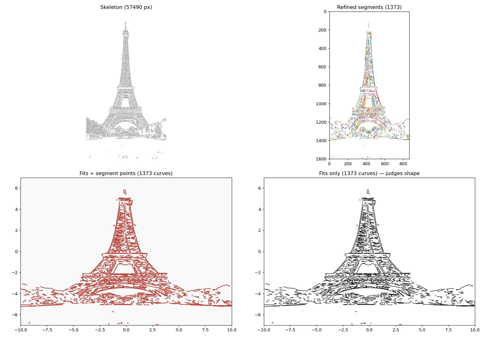
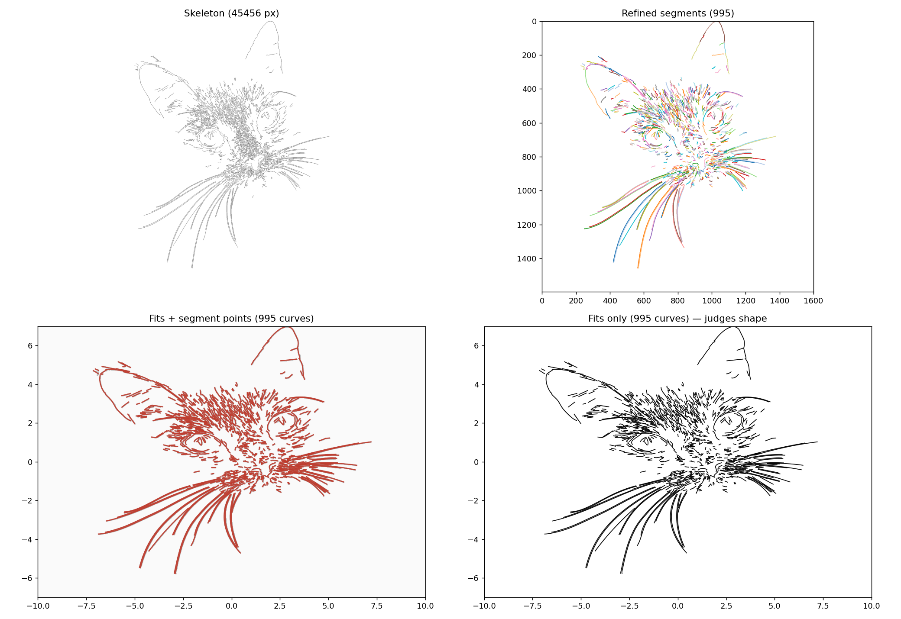

# Art Graphing Calculator

> a math project

Quick Start:
1. clone the project
```bash
git clone https://github.com/Roy-PAUSD/AGC.git
```
3. use venv or global environment to install the requirements
```bash
python -m venv .venv
source .venv/bin/activate # only tested on Linux, other OS may behave differently
pip install -r requirements.txt
```
5. start using `python app.py` port and adress should be prompted
6. Enjoy :)

How it works:


Show cases:





